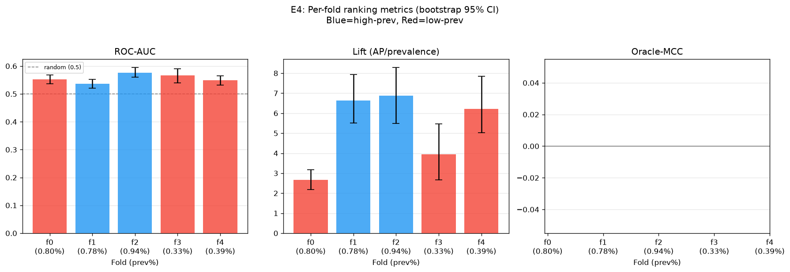
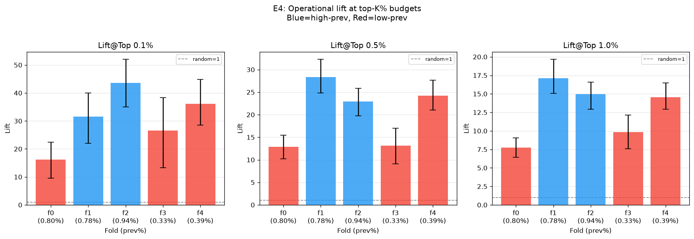
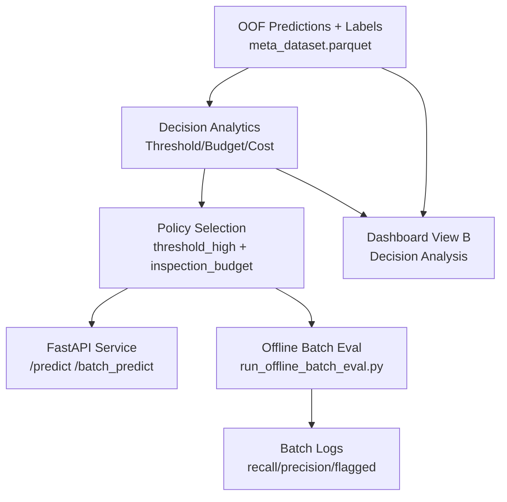
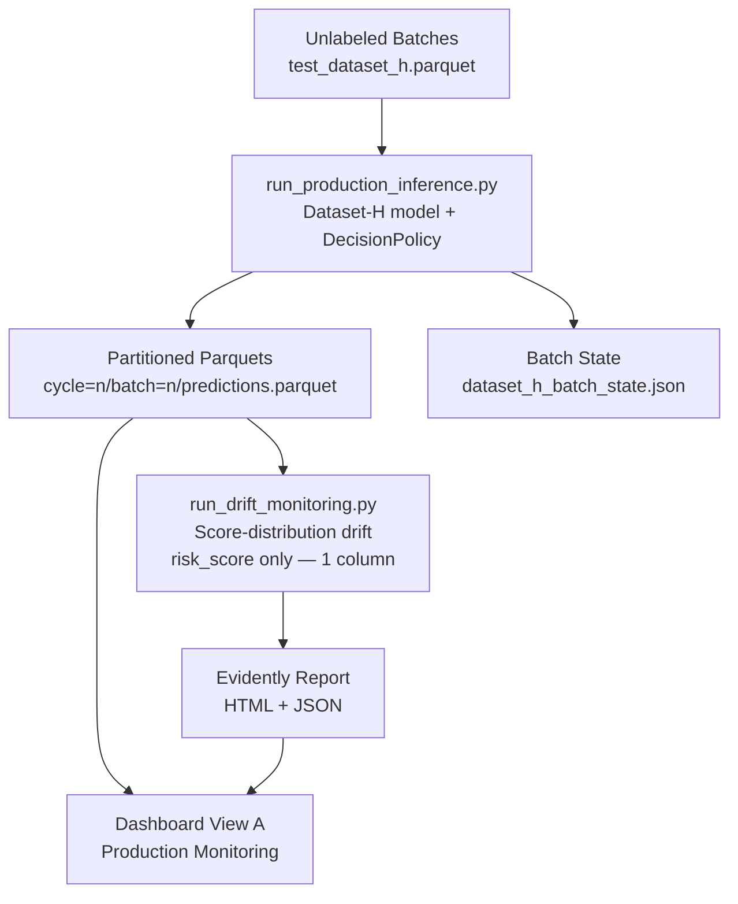

# Bosch Production Line — Failure Detection & Decision System

[](https://github.com/anudeepreddy332/bosch-production-line-defect-analysis/actions/workflows/ci.yml)
[](LICENSE)
[](pyproject.toml)

A production-style ML decision system for detecting manufacturing failures in the Bosch Production
Line Performance dataset (~0.58% failure rate, ~1.18M parts, ~2,000 anonymized sensor/route
features). The system is built around a deliberate constraint: **optimize for what is actually
deployable** — leakage-safe features, an honestly measured operating range, cost-based decision
thresholds, and label-free production monitoring — rather than for the single highest offline MCC.

That constraint is also the subject of a second, clearly separated body of work in this repository:
a rigorously governed Kaggle leaderboard-optimization track that measures, quantifies, and fully
attributes exactly how much of this dataset's famous "magic" leaderboard performance comes from
mechanisms that are **not deployable in production** — record-adjacency leakage, duplicate/identity
signature keys, and eventually raw signal width plus capacity tuning. Both bodies of work are real,
both are measured, and neither is allowed to influence the other's numbers.

**One-line summary:** deployable model, honestly measured at MCC 0.06–0.18 across operating
regimes → separately, a 9-experiment, fully-attributed Kaggle research program that pushed the
same dataset's competition leaderboard from 0.162 to **0.419 private MCC**, entirely through
mechanisms this project's own charter excludes from production.

## Start here

| Document | What it's for |
|---|---|
| **[`SYSTEM_OVERVIEW.md`](SYSTEM_OVERVIEW.md)** | One-page map of every track, doc, and artifact in this repository |
| **[`docs/CASE_STUDY_BOSCH_PRODUCTION_SYSTEM.md`](docs/CASE_STUDY_BOSCH_PRODUCTION_SYSTEM.md)** | The business-facing writeup: decision system, cost model, measured operating points |
| **[`docs/research/kaggle_decisions.md`](docs/research/kaggle_decisions.md)** | The full, pre-registered Kaggle research log (KDR-001–KDR-009) |
| **[`results/leaderboard.json`](results/leaderboard.json)** | Machine-readable results registry — the source of truth for every Kaggle number in this repo |
| **[`docs/implementation/portfolio_master_plan.md`](docs/implementation/portfolio_master_plan.md)** | The execution ledger currently driving this repository's engineering roadmap |

---

## Results

### Production system — deployable, honestly measured (Track 1 / Track 3)

Reproducible via 5-fold rolling-origin forward-chaining evaluation
(`outputs/e3_rolling_origin_results.json`; full derivation in the
[case study](docs/CASE_STUDY_BOSCH_PRODUCTION_SYSTEM.md) and
[`docs/reproducible_metrics_report.md`](docs/reproducible_metrics_report.md)):

| Metric | Value |
|---|---|
| Deployable MCC, across 5 temporal windows | **0.06 – 0.18** (mean 0.119, 95% CI [0.052, 0.187]) |
| Ranking quality (AUC), across regimes | **≈ 0.55**, stable (degradation −0.001) — ranking is not the bottleneck |
| Threshold transferability | **Not deployable** as a fixed value — optimal threshold ranged 0.14–0.72 across windows |
| Binding constraint | Non-stationary failure prevalence (0.33%–0.94%) across windows, not model capacity or features |

The honest finding (RP2, `docs/research/decisions.md` DR-011–DR-015) is that this dataset's
deployable performance is a **regime distribution**, not a single number — and that the system
needs periodic threshold recalibration, not a better model, to handle it. Two supporting charts
from this evaluation (reused from `outputs/`, not regenerated for this document):

<br>


*Left-to-right reading: ranking quality doesn't degrade under prevalence shift (top chart), and the
same model still delivers large operational lift over random inspection at any fixed budget (bottom
chart) — low MCC does not mean the system is operationally useless, it means MCC alone is the wrong
headline number for this problem.*

### Kaggle research track — competition leaderboard, frozen at P1 (Track 2)

**Not a production claim.** Every row below uses mechanisms this project's own production charter
forbids (record-adjacency leakage, identity/duplicate signature lookups, and eventually just far
more raw columns than a production feature contract would carry). The track exists to *measure* the
gap between "competition-legal" and "deployable," not to close it. Canonical source:
[`results/leaderboard.json`](results/leaderboard.json); full governance trail:
[`docs/research/kaggle_decisions.md`](docs/research/kaggle_decisions.md) (KDR-001–KDR-009, tag
`track2-frozen`).

| Experiment | Mechanism | OOF MCC | Public LB | Private LB | Verdict |
|---|---|---|---|---|---|
| K1 | Frozen production model (`dataset_h`), reproducibility check | 0.15337 | 0.14389 | 0.16160 | PASS |
| K2 | Record-adjacency "magic": neighbor position/time deltas + train-neighbor label lookup | 0.37530 † | 0.31699 | 0.32702 | `H_adjacency_dominant` CONFIRMED |
| K3-A | K2 ablation: record proximity only (label-free) | 0.31761 | 0.31791 | 0.33161 | `H_position_dominant` CONFIRMED |
| K3-B | K2 ablation: neighbor-label lookup only | 0.21171 † | 0.10065 | 0.10530 | REJECTED — falls below the K1 honest baseline |
| K4 | Label-free timing-cohort geometry on K3-A | 0.32192 | 0.31697 | 0.33447 | `H_cohort_modest` CONFIRMED (low end) |
| K5-A | Duplicate/identity signature keys, label-free, on K3-A | 0.32506 | 0.32330 | 0.33711 | `H_duplicate_material` CONFIRMED |
| K5-B | Identity-conditioned neighbor-label lookup on K3-A | 0.57828 † | 0.33571 | 0.33989 | CONFIRMED — best-to-date at time of measurement |
| P0 | Raw ~968-column numeric matrix + high-capacity LightGBM | 0.37892 | 0.39226 | 0.40391 | `H_raw_dominant` CONFIRMED |
| **P1** | Station-temporal features + LightGBM capacity tuning (`num_leaves` 63→255) | 0.39484 | **0.40447** | **0.41917** | `H_station_temporal_moderate` CONFIRMED — **program best** |

† OOF computed with a label-leaking feature — not a valid ranking metric on its own; only the
Kaggle LB legitimately measures these rows (see `kaggle_decisions.md`, "What must never happen").

**Six pre-registered hypothesis tests (KDR-003 through KDR-008), six confident classifications,
zero inconclusive results.** Private MCC progression: 0.16160 → 0.32702 → 0.33161 → 0.33447 →
0.33711 → 0.33989 → 0.40391 → **0.41917**. The single largest lever in the program (P0, raw signal
width) outweighed every leakage-family experiment combined; the second-largest (P1) came mostly
from LightGBM capacity tuning, not new features — the full attribution, postmortem, and revised
forward estimate (~0.435–0.445, not the original ~0.52 target) are recorded in KDR-009, which
formally freezes the track.

---

## Architecture

Two tracks run in parallel on `main` for the production system (a third, Kaggle, is fully quarantined
— see [`SYSTEM_OVERVIEW.md`](SYSTEM_OVERVIEW.md) for how all three fit together). Diagrams below are
reused as-is from [`docs/architecture.md`](docs/architecture.md):

**Track 1 — Offline / Decision Layer (labeled OOF data):**



**Track 3 — Production Inference (label-free):**



Full component/entrypoint table, deployability notes, and the Track 2 (Kaggle) quarantine
boundary are in [`SYSTEM_OVERVIEW.md`](SYSTEM_OVERVIEW.md) and
[`docs/architecture.md`](docs/architecture.md).

---

## Quickstart

```bash
# Environment
python -m venv .venv && source .venv/bin/activate   # or your preferred env manager
make setup    # pip install -r requirements.txt

# Training pipeline (run in order; each step reads parquet outputs of the previous one)
python scripts/pipeline/prepare_data.py --zip-path ~/Downloads/bosch-production-line-performance.zip
python scripts/pipeline/build_dataset_baseline.py
python scripts/pipeline/build_dataset_g.py
python scripts/pipeline/build_dataset_h.py
python scripts/pipeline/train_baseline.py
python scripts/pipeline/train_dataset_g.py
python scripts/pipeline/train_dataset_h.py
python scripts/pipeline/train_meta_model.py

# Production / decision pipeline (operates on the OOF/meta predictions above, not raw CSVs)
python scripts/pipeline/run_full_system.py
python scripts/pipeline/validate_system.py

# Tests + lint
make test     # pytest, ~2s, 73 tests
make lint     # ruff check .

# Serving
uvicorn apps.api.main:app --host 0.0.0.0 --port 8000
streamlit run apps/streamlit_dashboard/app.py
# ...or both, in Docker:
make docker-up   # docker compose up --build
```

> `prepare_data.py` defaults to processing the full raw CSVs with no row cap. Pass
> `--sample-rows 50000 --sample-tag dev` for a fast dev-sample path — see
> [`docs/reproducible_metrics_report.md`](docs/reproducible_metrics_report.md) for the exact
> dev-sample vs. full-scale command sequences and which metrics each one reproduces, and
> [`data/README.md`](data/README.md) for the provenance of the committed data artifacts.

Everything above runs from a single branch (`main`) — training and production pipelines were
originally split across two branches during development; they were merged and now live together.
`tests/` (decision-engine, CV-leakage guards, synthetic feature fixtures, submission validator,
API, and a value-locking check on `results/leaderboard.json`) runs in CI on every push and PR
(lint → test → both Docker images build → leaderboard schema check —
[`.github/workflows/ci.yml`](.github/workflows/ci.yml)). `scripts/pipeline/validate_system.py`
remains the closest thing to an end-to-end correctness check on real pipeline output.

Runbooks with full command-level detail for local setup, each of the three tracks, the dashboard,
Docker, S3, and EC2 deployment live in [`docs/runbooks/`](docs/runbooks/README.md).

---

## Dashboard

**View A — Production Monitoring (Track 3, label-free):** batch/cycle progress, risk-score
distribution, auto-reject/manual-inspect counts, Evidently score-distribution drift (KS test on
`risk_score`), top-100-by-risk-score table.

**View B — Offline Evaluation / Decision Analysis (Track 1, labeled OOF):** threshold tuning,
inspection-budget simulation, recall/precision trade-offs, cost optimization, failure analysis.

Today this is a Streamlit app that reads from S3 (`apps/streamlit_dashboard/app.py`) — see the
[master plan](docs/implementation/portfolio_master_plan.md) (PF4) for the static, credential-free,
recruiter-facing dashboard planned on top of the same data.

---

## Tech stack

Python, pandas, LightGBM · Chunk-aware `StratifiedGroupKFold` CV (`src/training/cv.py`) · FastAPI
(serving) · Streamlit (dashboard) · Evidently (drift monitoring) · Docker (`Dockerfile.api`,
`Dockerfile.dashboard`, `docker-compose.yml`) · S3 (append-only prediction partitions).

## Governance

Every non-trivial decision in this repository — model selection, feature-family inclusion,
threshold policy, and every Kaggle experiment — is pre-registered before results exist and closed
with an Evidence/Outcome/Decision record, mirroring how a real ML org would run a decision log:

- **Track 1 / Track 3 (production):** [`docs/research/decisions.md`](docs/research/decisions.md) —
  DR-001 through DR-015, tags `track1-frozen` / `track3-frozen`.
- **Track 2 (Kaggle):** [`docs/research/kaggle_decisions.md`](docs/research/kaggle_decisions.md) —
  KDR-001 through KDR-009, tag `track2-frozen`. Registry: `results/leaderboard.json`.
- **Repository engineering:** [`docs/implementation/portfolio_master_plan.md`](docs/implementation/portfolio_master_plan.md)
  — the currently active phase (PF1) and everything after it.

## What's next

The Kaggle research program is frozen (KDR-009) — the roadmap from here is repository engineering,
not further modeling, and it's tracked as a phased, checkpointed plan rather than a wishlist:
[`docs/implementation/portfolio_master_plan.md`](docs/implementation/portfolio_master_plan.md).
Concretely queued: a minimal test suite + CI, a static recruiter-facing dashboard, a documentation
site, and a `v1.0.0` release. On the production side, the case study's own
["Remaining Work"](docs/CASE_STUDY_BOSCH_PRODUCTION_SYSTEM.md#12-production-readiness-status) still
applies: periodic threshold recalibration and automated drift alerting are designed but not wired up.

## License

[MIT](LICENSE). The Bosch competition data itself is subject to Kaggle's own terms and is not
redistributed in this repository.

## Author

Anudeep Reddy Mutyala
