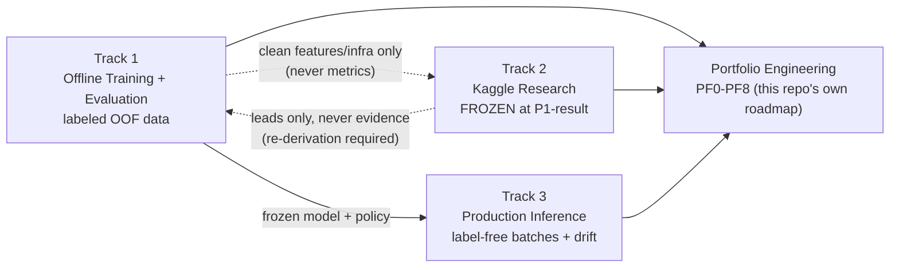

# System Overview

One page, every major artifact in this repository linked from here. If you only read one document
before digging into code, read this one (or the [README](README.md) first, for the results).

## The shape of the project

Three ML tracks, kept structurally separate, plus a fourth non-ML track (this repository's own
engineering) that turns the whole thing into a portfolio artifact.

## Tracks

| Track | State | Governing log | Entry point |
|---|---|---|---|
| **Track 1** — Offline Training + Evaluation | Frozen (`track1-frozen`) | [`docs/research/decisions.md`](docs/research/decisions.md) (DR-001–DR-015) | `scripts/pipeline/train_dataset_h.py`, `src/evaluation/decision_system.py` |
| **Track 2** — Kaggle Research | Frozen (`track2-frozen`, KDR-009) | [`docs/research/kaggle_decisions.md`](docs/research/kaggle_decisions.md) (KDR-001–KDR-009) | `results/leaderboard.json`, `src/kaggle/`, `scripts/kaggle/` |
| **Track 3** — Production Inference | Frozen (`track3-frozen`) | [`docs/research/decisions.md`](docs/research/decisions.md) (DR-011–DR-015 for RP2) | `scripts/pipeline/run_production_inference.py`, `scripts/pipeline/run_drift_monitoring.py` |
| **Portfolio Engineering** — this repo's own transition | Active (PF1) | [`docs/implementation/portfolio_master_plan.md`](docs/implementation/portfolio_master_plan.md) | the master plan itself |

Why three ML tracks and not one "production" bucket: `docs/ml_system_tracks.md` (the canonical
statement of this split, and its own audit of where the code did/didn't match it at each point in
time).

## Results

- **Production (deployable, honest):** MCC 0.06–0.18 across 5 temporal regimes, AUC ≈ 0.55 stable.
  Full derivation: [case study](docs/CASE_STUDY_BOSCH_PRODUCTION_SYSTEM.md) §7,
  `outputs/e3_rolling_origin_results.json`.
- **Kaggle (competition leaderboard, frozen):** private MCC 0.16160 → **0.41917** across 9
  attributed experiments. Registry: [`results/leaderboard.json`](results/leaderboard.json). Full
  log: [`docs/research/kaggle_decisions.md`](docs/research/kaggle_decisions.md).
- Both numbers are in the [README](README.md#results) side by side, on purpose — the gap between
  them is itself the point of this project.

## Architecture

- [`docs/architecture.md`](docs/architecture.md) — Track 1 / Track 3 Mermaid data-flow diagrams,
  runtime component table, entrypoints, deployability notes. (Reproduced in the README too.)
- Track 2 has no equivalent diagram yet (`src/kaggle/` + `scripts/kaggle/`, quarantined behind a
  firewall grep so nothing outside those two trees can import them) — queued in the master plan.

## Dashboard

`apps/streamlit_dashboard/app.py` — two views (Production Monitoring / Track 3, Offline Evaluation
/ Track 1), currently reading from S3. A static, credential-free, recruiter-facing dashboard is
specified and queued in the [master plan](docs/implementation/portfolio_master_plan.md) (PF4).

## Deployment

- `Dockerfile.api` + `Dockerfile.dashboard` + `docker-compose.yml` — both services, dev-oriented
  today; hardening queued in the master plan (PF2).
- `apps/api/main.py` — FastAPI service over precomputed scores (`/health`, `/predict`,
  `/batch_predict`), policy from `outputs/max_recall_system_summary.json`.
- Hosting plan for a live, always-on deployment: master plan PF4/PF7.

## Research

- **Track 1/3 decision log:** [`docs/research/decisions.md`](docs/research/decisions.md).
- **Track 2 (Kaggle) decision log:** [`docs/research/kaggle_decisions.md`](docs/research/kaggle_decisions.md),
  9 sealed experiments, 6 pre-registered hypothesis classifications, all confident — no
  inconclusive results. Frozen at KDR-009.
- **Results registry:** [`results/leaderboard.json`](results/leaderboard.json) — the single source
  of truth every other document's Kaggle numbers trace back to.
- **Runbook:** [`docs/runbooks/track2_kaggle_submission.md`](docs/runbooks/track2_kaggle_submission.md).

## Case study

[`docs/CASE_STUDY_BOSCH_PRODUCTION_SYSTEM.md`](docs/CASE_STUDY_BOSCH_PRODUCTION_SYSTEM.md) — the
business-facing writeup: problem framing, cost model, decision policy, measured operating points,
monitoring, and production-readiness status. Written for a reader who cares about the decision
system, not the modeling internals.

## Reproducibility & data provenance

- [`data/README.md`](data/README.md) — which committed artifacts are reproducible from code today
  ("World A", a 50k-row dev sample) vs. preserved-but-not-regenerable historical artifacts
  ("World B").
- [`docs/reproducible_metrics_report.md`](docs/reproducible_metrics_report.md) — exact numbers and
  regeneration commands for both.
- `data/processed/PROVENANCE.json` — the one data-provenance file tracked in git despite
  `data/processed/` otherwise being gitignored.

## Governance & engineering roadmap

- [`docs/implementation/portfolio_master_plan.md`](docs/implementation/portfolio_master_plan.md) —
  the execution ledger for turning this repository into a public portfolio (PF0–PF8). This is the
  **only** forward-looking planning document in the repository; if you're looking for "what's
  next," it's here, not in a stray TODO list.
- `docs/runbooks/` — command-level guides: local setup, each of the three tracks, dashboard,
  Docker, S3, EC2, troubleshooting.

## Everything else, in one table

| I want to... | Go to |
|---|---|
| See the headline results | [`README.md`](README.md#results) |
| Understand the business case | [`docs/CASE_STUDY_BOSCH_PRODUCTION_SYSTEM.md`](docs/CASE_STUDY_BOSCH_PRODUCTION_SYSTEM.md) |
| Verify a Kaggle number | [`results/leaderboard.json`](results/leaderboard.json) → cite the `kdr` field → look it up in [`docs/research/kaggle_decisions.md`](docs/research/kaggle_decisions.md) |
| Reproduce a metric | [`docs/reproducible_metrics_report.md`](docs/reproducible_metrics_report.md) |
| Run the system locally | [`README.md`](README.md#quickstart) or [`docs/runbooks/local_setup.md`](docs/runbooks/local_setup.md) |
| Understand the three-track split | [`docs/ml_system_tracks.md`](docs/ml_system_tracks.md) |
| See what's being worked on next | [`docs/implementation/portfolio_master_plan.md`](docs/implementation/portfolio_master_plan.md) |
