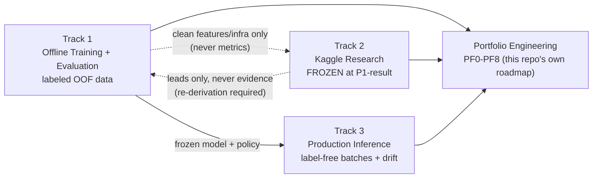

# System Overview

One page, every major artifact in this repository linked from here. If you only read one document
before digging into code, read this one (or the [README](README.md) first, for the results).

**Live:** [dashboard](https://bosch.themachinist.org) · [docs site](https://bosch.themachinist.org/docs/) ·
[`v1.0.0` release](https://github.com/anudeepreddy332/bosch-production-line-defect-analysis/releases/tag/v1.0.0)

## The shape of the project

Three ML tracks, kept structurally separate, plus a fourth non-ML track (this repository's own
engineering) that turns the whole thing into a portfolio artifact.

## Tracks

| Track | State | Governing log | Entry point |
|---|---|---|---|
| **Track 1** — Offline Training + Evaluation | Frozen (`track1-frozen`) | [`docs/research/decisions.md`](docs/research/decisions.md) (DR-001–DR-015) | `scripts/pipeline/train_dataset_h.py`, `src/evaluation/decision_system.py` |
| **Track 2** — Kaggle Research | Frozen (`track2-frozen`, KDR-009) | [`docs/research/kaggle_decisions.md`](docs/research/kaggle_decisions.md) (KDR-001–KDR-009) | `results/leaderboard.json`, `src/kaggle/`, `scripts/kaggle/` |
| **Track 3** — Production Inference | Frozen (`track3-frozen`) | [`docs/research/decisions.md`](docs/research/decisions.md) (DR-011–DR-015 for RP2) | `scripts/pipeline/run_production_inference.py`, `scripts/pipeline/run_drift_monitoring.py` |
| **Portfolio Engineering** — this repo's own transition | PF0–PF6 complete; PF8 under review; PF7 optional | [`docs/implementation/portfolio_master_plan.md`](docs/implementation/portfolio_master_plan.md) | the master plan itself |

Why three ML tracks and not one "production" bucket: `docs/ml_system_tracks.md` (the canonical
statement of this split, and its own audit of where the code did/didn't match it at each point in
time).

## Results

- **Production (deployable, honest):** MCC 0.06–0.18 across 5 temporal regimes, AUC ≈ 0.55 stable.
  Full derivation: [case study](docs/CASE_STUDY_BOSCH_PRODUCTION_SYSTEM.md) §7,
  `outputs/e3_rolling_origin_results.json`.
- **Kaggle (competition leaderboard, frozen):** private MCC 0.16160 → **0.41917** across 9
  attributed experiments. Registry: [`results/leaderboard.json`](results/leaderboard.json). Full
  log: [`docs/research/kaggle_decisions.md`](docs/research/kaggle_decisions.md).
- Both numbers are in the [README](README.md#results) side by side, on purpose — the gap between
  them is itself the point of this project.

## Architecture

- [`docs/architecture.md`](docs/architecture.md) — Track 1 / Track 2 / Track 3 Mermaid data-flow
  diagrams, runtime component table, entrypoints, deployability notes. (Track 1/3 reproduced in
  the README too.)
- See "The production pipeline, end to end" below for an index-level walkthrough of Track 1 + 3.

## The production pipeline, end to end

Seven stages, raw data to a monitored decision — index-level only; diagrams and the full
component table live in [`docs/architecture.md`](docs/architecture.md).

1. **Raw Bosch manufacturing data.** `scripts/pipeline/prepare_data.py` converts the raw Kaggle
   CSVs (numeric/date/categorical, train + test) into chunked Parquet, recording provenance in
   `data/processed/PROVENANCE.json`.
2. **Feature engineering.** `scripts/pipeline/build_dataset_{baseline,g,h}.py` derive three
   progressively richer, leakage-safe feature sets — target-rate and path-transition features are
   computed fold-by-fold from training-fold statistics only, never from the full dataset at once.
3. **Model training.** `scripts/pipeline/train_{baseline,dataset_g,dataset_h}.py` each train a
   LightGBM model via chunk-aware `StratifiedGroupKFold` CV; `train_meta_model.py` stacks the
   three OOF predictions into a final model.
4. **Rolling-origin validation (RP2).** `scripts/research/train_e3_rolling_origin.py` re-evaluates
   the frozen `dataset_h` model across 5 forward-chaining time windows (train on the past, score
   the future) — this is what produces the headline **deployable MCC 0.06–0.18** range in
   [Results](#results) above, a different number from step 3's single chunk-aware OOF score.
5. **Decision engine / threshold policy.** `src/evaluation/decision_system.py` sweeps
   thresholds/inspection budgets against a cost model (`CostConfig`, default: a missed failure
   costs 20× a false alarm) to pick an operating point; `src/inference/decision_engine.py`'s
   `DecisionPolicy` is the runtime object (threshold + budget) both the API and batch scorer apply.
6. **Deployment.** `apps/api/main.py` serves `DecisionPolicy` over precomputed scores
   (`/predict`, `/batch_predict`); `scripts/pipeline/run_production_inference.py` applies the same
   policy to label-free unlabeled batches, append-only partitioned output. Both the decision
   summary and the production/monitoring steps below are orchestrated by
   `scripts/pipeline/run_full_system.py` (`build_decision_summary.py` →
   `run_production_inference.py` → `run_drift_monitoring.py`).
7. **Monitoring and drift detection.** `scripts/pipeline/run_drift_monitoring.py` reads only the
   label-free production batches and runs Evidently drift detection on the single `risk_score`
   column, writing `outputs/monitoring/evidently_summary.json` + HTML — rendered in the internal
   dashboard's Production Monitoring view.

## Dashboard

**Recruiter dashboard (live, primary):** [bosch.themachinist.org](https://bosch.themachinist.org) —
Story / Decision Explorer / Model Internals / Governance & Reproducibility, built from
[`dashboard/`](dashboard/) (Vite + React + TypeScript), static and credential-free, deployed via
[`.github/workflows/deploy-pages.yml`](.github/workflows/deploy-pages.yml).

**Internal operator dashboard:** `apps/streamlit_dashboard/app.py` — the same two views (Production
Monitoring / Track 3, Offline Evaluation / Track 1) this document described before the recruiter
dashboard shipped; `DATA_SOURCE=local` by default (credential-free) or `s3`.

## Deployment

- `Dockerfile.api` + `Dockerfile.dashboard` + `docker-compose.yml` — both services, hardened in
  PF2 (non-root users, healthchecks, `.dockerignore`).
- `apps/api/main.py` — FastAPI service over precomputed scores (`/health`, `/predict`,
  `/batch_predict`), policy from `outputs/max_recall_system_summary.json`.
- The recruiter dashboard is live and hosted (PF4); an always-on VPS tier for the API
  (`api.`/`console.` subdomains) is optional and not started — master plan PF7.

## Research

- **Track 1/3 decision log:** [`docs/research/decisions.md`](docs/research/decisions.md).
- **Track 2 (Kaggle) decision log:** [`docs/research/kaggle_decisions.md`](docs/research/kaggle_decisions.md),
  9 sealed experiments, 6 pre-registered hypothesis classifications, all confident — no
  inconclusive results. Frozen at KDR-009.
- **Results registry:** [`results/leaderboard.json`](results/leaderboard.json) — the single source
  of truth every other document's Kaggle numbers trace back to.
- **Runbook:** [`docs/runbooks/track2_kaggle_submission.md`](docs/runbooks/track2_kaggle_submission.md).

## Case study

[`docs/CASE_STUDY_BOSCH_PRODUCTION_SYSTEM.md`](docs/CASE_STUDY_BOSCH_PRODUCTION_SYSTEM.md) — the
business-facing writeup: problem framing, cost model, decision policy, measured operating points,
monitoring, and production-readiness status. Written for a reader who cares about the decision
system, not the modeling internals.

## Reproducibility & data provenance

- [`data/README.md`](data/README.md) — which committed artifacts are reproducible from code today
  vs. preserved-but-not-regenerable historical artifacts ("World B"). The models currently on disk
  were trained on the full-scale run (1,183,747 rows, confirmed in
  `data/processed/PROVENANCE.json`), not the smaller dev sample `docs/reproducible_metrics_report.md`
  §1 still describes as current — that doc is due a refresh (tracked in the master plan's PF8
  backlog).
- [`docs/reproducible_metrics_report.md`](docs/reproducible_metrics_report.md) — exact numbers and
  regeneration commands.
- `data/processed/PROVENANCE.json` — the one data-provenance file tracked in git despite
  `data/processed/` otherwise being gitignored.

## Governance & engineering roadmap

- [`docs/implementation/portfolio_master_plan.md`](docs/implementation/portfolio_master_plan.md) —
  the execution ledger for turning this repository into a public portfolio (PF0–PF8). This is the
  **only** forward-looking planning document in the repository; if you're looking for "what's
  next," it's here, not in a stray TODO list.
- `docs/runbooks/` — command-level guides: local setup, each of the three tracks, dashboard,
  Docker, S3, EC2, troubleshooting.

## Everything else, in one table

| I want to... | Go to |
|---|---|
| See the headline results | [`README.md`](README.md#results) |
| Understand the business case | [`docs/CASE_STUDY_BOSCH_PRODUCTION_SYSTEM.md`](docs/CASE_STUDY_BOSCH_PRODUCTION_SYSTEM.md) |
| Verify a Kaggle number | [`results/leaderboard.json`](results/leaderboard.json) → cite the `kdr` field → look it up in [`docs/research/kaggle_decisions.md`](docs/research/kaggle_decisions.md) |
| Reproduce a metric | [`docs/reproducible_metrics_report.md`](docs/reproducible_metrics_report.md) |
| Run the system locally | [`README.md`](README.md#quickstart) or [`docs/runbooks/local_setup.md`](docs/runbooks/local_setup.md) |
| Understand the three-track split | [`docs/ml_system_tracks.md`](docs/ml_system_tracks.md) |
| See what's being worked on next | [`docs/implementation/portfolio_master_plan.md`](docs/implementation/portfolio_master_plan.md) |
