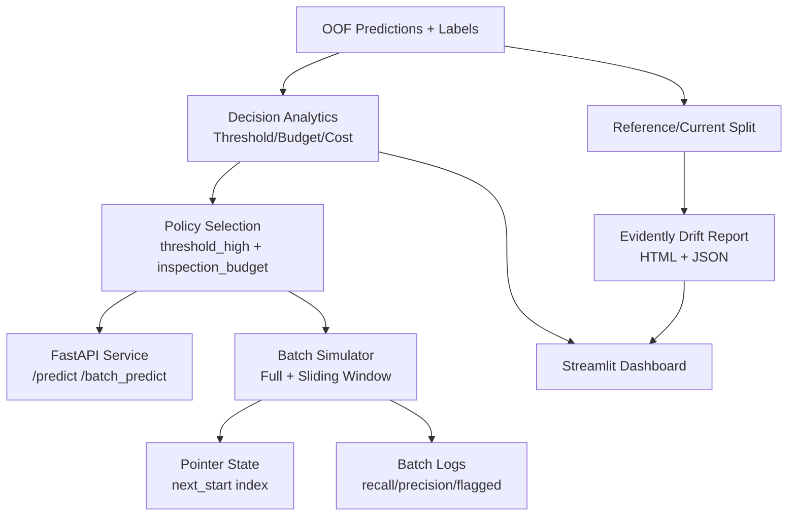

# Production Architecture

## Data Flow
1. Load prediction artifacts and labels from `data/features` and `outputs`.
2. Build decision table across thresholds and inspection budgets.
3. Apply business cost model (`FN=100`, `FP=5`) to rank operating points.
4. Run simulation in either:
   - full replay mode
   - sliding-window mode with persistent pointer and reset-on-end.
5. Generate drift reports with Evidently on stable reference/current split (ID columns excluded).

## Runtime Components
- Decision framework: `src/evaluation/decision_system.py`
- Inference decision engine: `src/inference/decision_engine.py`
- Batch simulator: `scripts/run_batch_simulation.py`
- Monitoring: `src/monitoring/drift_detection.py`
- API: `apps/api/main.py`
- Dashboard: `apps/streamlit_dashboard/app.py`

## Entrypoints
- End-to-end: `python scripts/run_full_system.py`
- Validation: `python scripts/validate_system.py`
- Monitoring report: `python scripts/run_drift_monitoring.py`
- API server: `uvicorn apps.api.main:app --host 0.0.0.0 --port 8000`
- Dashboard: `streamlit run apps/streamlit_dashboard/app.py`

## Deployability
- `Dockerfile.api`
- `Dockerfile.dashboard`
- `docker-compose.yml`
