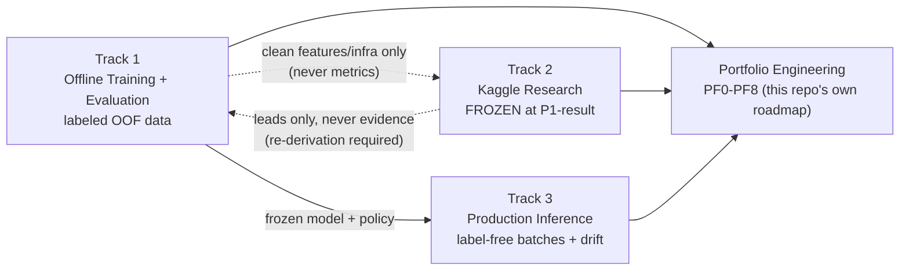

# System Overview

One page, every major artifact in this repository linked from here. This page mirrors
[`SYSTEM_OVERVIEW.md`](https://github.com/anudeepreddy332/bosch-production-line-defect-analysis/blob/main/SYSTEM_OVERVIEW.md)
at the repo root — read that copy if you're browsing on GitHub instead of this site. If you only
read one page before digging into code, read this one (or the
[README](https://github.com/anudeepreddy332/bosch-production-line-defect-analysis#readme) first,
for the results).

## The shape of the project

Three ML tracks, kept structurally separate, plus a fourth non-ML track (this repository's own
engineering) that turns the whole thing into a portfolio artifact.

## Tracks

| Track | State | Governing log | Landing page |
|---|---|---|---|
| **Track 1** — Offline Training + Evaluation | Frozen (`track1-frozen`) | [Research Log](research/README.md) (DR-001–DR-015) | [Track 1](track1.md) |
| **Track 2** — Kaggle Research | Frozen (`track2-frozen`, KDR-009) | [Research Log](research/README.md) (KDR-001–KDR-009) | [Track 2](track2.md) |
| **Track 3** — Production Inference | Frozen (`track3-frozen`) | [Research Log](research/README.md) (DR-011–DR-015 for RP2) | [Track 3](track3.md) |
| **Portfolio Engineering** — this repo's own transition | Active | the master plan itself (linked from the repo root) | — |

Why three ML tracks and not one "production" bucket: see the
[Track 1](track1.md#why-not-just-one-production-track) landing page.

## Results

- **Production (deployable, honest):** MCC 0.06–0.18 across 5 temporal regimes, AUC ≈ 0.55 stable.
- **Kaggle (competition leaderboard, frozen):** private MCC 0.16160 → **0.41917** across 9
  attributed experiments.
- Both numbers are shown side by side, on purpose, on the [Results](results.md) page — the gap
  between them is itself the point of this project.

## Architecture

[Architecture](architecture.md) — Track 1 / Track 2 / Track 3 data-flow diagrams, runtime
component table, entrypoints, deployability notes.

## Dashboard

The recruiter-facing dashboard at [bosch.themachinist.org](https://bosch.themachinist.org) has
four pages (Story, Decision Explorer, Model Internals, Governance & Reproducibility), reading a
static JSON bundle generated by `scripts/ops/export_dashboard_data.py` — no server, no
credentials. `apps/streamlit_dashboard/app.py` is the older, credentialed local/S3 operator view
(two Streamlit pages: Production Monitoring / Track 3, Offline Evaluation / Track 1).

## Research

- **Track 1/3 decision log** and **Track 2 (Kaggle) decision log** — see the
  [Research Log overview](research/README.md) for how to read either one, plus the
  [Research Summary](RESEARCH_SUMMARY.md) postmortem of the whole Kaggle ladder.
- **Results registry** — `results/leaderboard.json` (repo root) is the single source of truth
  every other document's Kaggle numbers trace back to.

## Case study

[Case Study](CASE_STUDY_BOSCH_PRODUCTION_SYSTEM.md) — the business-facing writeup: problem
framing, cost model, decision policy, measured operating points, monitoring, and
production-readiness status. Written for a reader who cares about the decision system, not the
modeling internals.

## Model & data provenance

- [Model Card](model_card.md) — the production `dataset_h` model and the frozen Kaggle P1 model,
  side by side, with the deployability gap stated plainly.
- [Data Card](data_card.md) — Kaggle license terms, how to obtain the data, and the fingerprint
  table used to verify a local run matches the recorded one.

## Governance & engineering roadmap

The portfolio-transition execution ledger
(`docs/implementation/portfolio_master_plan.md`, linked from the repo root) is the **only**
forward-looking planning document in the repository — if you're looking for "what's next," it's
there, not in a stray TODO list. This docs site is itself PF5 of that ledger.

## Everything else, in one table

| I want to... | Go to |
|---|---|
| See the headline results | [Results](results.md) |
| Understand the business case | [Case Study](CASE_STUDY_BOSCH_PRODUCTION_SYSTEM.md) |
| Verify a Kaggle number | [Research Log overview](research/README.md) → "how to read a KDR" |
| Reproduce a metric | [Data Card](data_card.md) |
| Run the system locally | [Runbooks → Local setup](runbooks/local_setup.md) |
| Understand the three-track split | [Track 1](track1.md) / [Track 2](track2.md) / [Track 3](track3.md) |
| See what's being worked on next | `docs/implementation/portfolio_master_plan.md` (repo root, GitHub only) |
